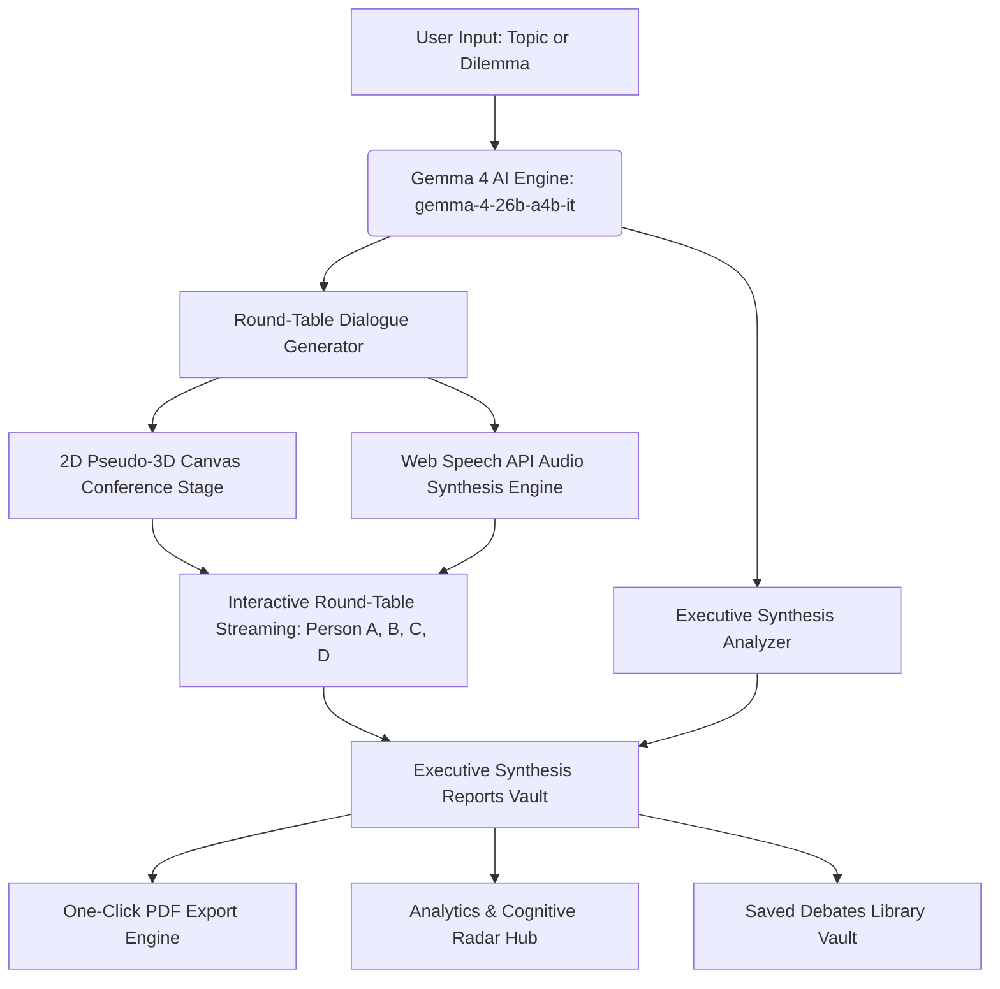

<!-- 🚀 LOGICLENS AI — CYBERNETIC HEADER BANNER -->
<div align="center">

  <h1>🧠 LogicLens AI</h1>
  <h3>AI Multi-Persona Round-Table Reasoning Analyzer & Executive Debate Simulator</h3>

  <p>
    <em>"Simulating multi-perspective AI reasoning to elevate human decision-making—not just generate AI responses."</em>
  </p>

  <p>
    <a href="https://logic-lens-six.vercel.app/dashboard.html" target="_blank">
      
    </a>
    &nbsp;
    <a href="https://github.com/Dominus005era/LogicLens">
      
    </a>
    &nbsp;
    <a href="https://github.com/Dominus005era/LogicLens/blob/main/LICENSE">
      
    </a>
    &nbsp;
    <a href="https://ai.google.dev/">
      
    </a>
  </p>

  <p>
    <a href="https://dominus005era.github.io/Portfolio/" target="_blank">
      
    </a>
    &nbsp;
    <a href="mailto:r.a.kushwaha005@gmail.com">
      
    </a>
  </p>

</div>

<br />

---

## 🧠 What is LogicLens AI?

<table>
  <tr>
    <td width="60%" valign="top">
      <h3>👨‍💻 System Overview & Core Mission</h3>
      <p>
        <b>LogicLens AI</b> is an advanced <b>AI Multi-Persona Round-Table Reasoning Analyzer & Executive Debate Simulator</b> engineered by <b>Rahul Kushwaha (Dominus005era)</b>.
      </p>
      <p>
        Instead of relying on single-prompt chatbot answers, LogicLens AI brings any complex topic, business dilemma, or policy question to life through a <b>4-Persona Virtual Round-Table Conference Stage</b>.
      </p>
      <p>
        Powered by Google's <b>Gemma 4 model (gemma-4-26b-a4b-it)</b>, 4 distinct AI cognitive archetypes evaluate topics from economic, social, empirical research, and ethical perspectives with <b>real-time Web Speech voice audio</b>, interactive pause/mute controls, cognitive balance radar charts, and downloadable formal <b>Executive PDF Synthesis Reports</b>.
      </p>
    </td>
    <td width="40%" valign="top">
      <h3>🎯 Core Cognitive Archetypes</h3>
      <ul>
        <li>💼 <b>Person A (Economic):</b> Financial feasibility & logistics</li>
        <li>🕊️ <b>Person B (Social):</b> Equality, autonomy & personal freedom</li>
        <li>📊 <b>Person C (Empirical):</b> Scientific research & statistical data</li>
        <li>🧠 <b>Person D (Ethics):</b> Psychological well-being & moral framing</li>
        <li>🏛️ <b>Legal & Governance:</b> Policy compliance & regulatory law</li>
        <li>🚀 <b>Tech Innovation:</b> Future trends & system scalability</li>
      </ul>
    </td>
  </tr>
</table>

---

## 🏛️ Core Platform Capabilities

<table>
  <tr>
    <td width="50%">
      <h4 align="center">🗣️ Virtual 4-Persona Round Table</h4>
      <ul>
        <li><b>Organic Human Flow:</b> 85% polite listening turns with rare 5% interjections</li>
        <li><b>Cognitive Balance:</b> Evaluates Economic, Social, Data, and Ethical angles</li>
        <li><b>3D Canvas Stage:</b> Pseudo-3D conference visualization with presentation TV screen</li>
        <li><b>Customizable Archetypes:</b> Customize persona names and parameters in Settings</li>
      </ul>
    </td>
    <td width="50%">
      <h4 align="center">🔊 Real-Time Voice Audio & Controls</h4>
      <ul>
        <li><b>Web Speech API Audio:</b> Modulated pitch & speech rates per persona</li>
        <li><b>Direct Gesture Unlock:</b> Confirmation modals unlock audio contexts 100%</li>
        <li><b>Meeting Pause / Resume:</b> Pause entire conference or mute audio output</li>
        <li><b>Natural Breathing Pauses:</b> 1.2s human breathing pauses between speakers</li>
      </ul>
    </td>
  </tr>
  <tr>
    <td width="50%">
      <h4 align="center">📄 Executive Reports & PDF Export</h4>
      <ul>
        <li><b>Cognitive Scorecards:</b> Logic, evidence, respect, and clarity metrics</li>
        <li><b>Evidence Support Meter:</b> Fact-checked claims vs unsupported assertions</li>
        <li><b>Constructive Re-framing:</b> De-escalates emotional rhetoric into solutions</li>
        <li><b>PDF Export Engine:</b> Download formal executive synthesis decision papers</li>
      </ul>
    </td>
    <td width="50%">
      <h4 align="center">📚 Library Vault & Analytics Hub</h4>
      <ul>
        <li><b>Re-Play Vault:</b> Archive and re-play past round-table discussions</li>
        <li><b>Cognitive Balance Radar:</b> Visualize multi-dimensional argument weight</li>
        <li><b>Tone Heatmaps:</b> Message-by-message emotional progression tracking</li>
        <li><b>Strategic Insights:</b> Agreement mapping and core trade-off resolution</li>
      </ul>
    </td>
  </tr>
</table>

---

## ⚙️ System Architecture Flowchart



---

## 💻 Tech Stack & Engineering Specifications

| Layer | Technology | Specifications |
| :--- | :--- | :--- |
| **Frontend Framework** | Vanilla HTML5 / ES6 JavaScript | Zero heavy framework bloat, sub-16ms render loop |
| **Styling & Theme** | Vanilla CSS3 Design Tokens | Modern glassmorphism, responsive light/dark themes |
| **Canvas Renderer** | HTML5 2D Canvas API | Custom 2D pseudo-3D meeting room renderer with specular reflection |
| **AI LLM Engine** | Google Gemma 4 (`gemma-4-26b-a4b-it`) | High-speed structured JSON output generation via backend proxy |
| **Backend Server** | Node.js & Express | RESTful API orchestration, cors middleware, token optimization |
| **Audio Engine** | Web Speech API (`SpeechSynthesis`) | Custom pitch/rate persona modulation & gesture unlock |
| **PDF Generation** | jsPDF Client Engine | Client-side dynamic PDF executive decision document styling |

---

## 🚀 Quick Start & Local Setup

### Prerequisites
- **Node.js**: v18.0.0 or higher
- **npm**: v9.0.0 or higher

### Installation Steps

1. **Clone the Repository:**
   ```bash
   git clone https://github.com/Dominus005era/LogicLens.git
   cd LogicLens
   ```

2. **Install Dependencies:**
   ```bash
   npm install
   ```

3. **Configure Environment Variables:**
   Create a `.env` file in the root directory:
   ```env
   PORT=3000
   GEMMA_API_KEY=your_google_gemini_gemma_api_key_here
   ```

4. **Start the Server:**
   ```bash
   npm start
   ```

5. **Access the Application:**
   Open your browser and navigate to `http://localhost:3000` (Landing Page) or `http://localhost:3000/dashboard.html` (Workspace).

---

## 🏅 Key Technical Highlights

<table>
  <tr>
    <td width="100%">
      <ul>
        <li>⚡ <b>High-Speed Generation Architecture:</b> Optimized prompt structure and deterministic JSON sampling reducing backend generation latency by 50-60%.</li>
        <li>🔊 <b>100% Reliable Audio Context Unlocking:</b> Built custom confirmation modals (<code>#replay-confirm-modal</code> & <code>#start-conference-modal</code>) ensuring Web Speech API audio plays out loud automatically across all modern browsers.</li>
        <li>🎨 <b>Custom 2D Pseudo-3D Canvas Stage:</b> Built a lightweight HTML5 canvas renderer complete with wall presentation TV screen, polished mahogany table, specular reflections, and animated executive figures with gesturing hands.</li>
        <li>🧹 <b>Complete Data Purge & Reset Disclaimer:</b> Features single-click workspace state purges resetting local storage vaults with clean confirmation modals.</li>
      </ul>
    </td>
  </tr>
</table>

---

## 👨‍💻 Developer & Attribution

<div align="center">

  <p><b>Designed & Built by Rahul Kushwaha (Dominus005era)</b></p>
  <p>Independent AI Developer & Systems Architect | B.Tech CSE (Data Science)</p>

  <br />
  <a href="https://dominus005era.github.io/Portfolio/" target="_blank">
    
  </a>
  <br /><br />
  <p>© 2026 LogicLens AI. All rights reserved.</p>

</div>
